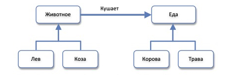
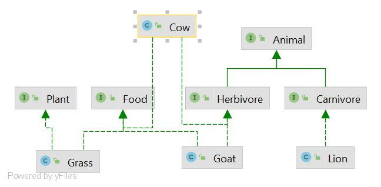

# Тестовое задание
### Состояние до:

### Моменты, которые можно улучшить:
- некоторые животные могут являться и поедающими кого-то (что-то) другое, и едой для других животных, а на диграмме животное или ест, или является едой
- животные могут быть травоядными, всеядными или плотоядными, в данной ситуации это важно, но маркеков для различения типа животного нет

### Решение:
- выделить главные абстрактные характеристики в интерфейсы (на данный момент это или Animal или Food)
  
  по необходимости объявить поведение, которое будет свойственно объектам классов имплементирующим интерфейс
- сделать разделение этих абстрактных характеристик, на менее абстрактные: 

  еда может быть или растительной (Plant) или животного происхождения (Animal)
  
  животные могут быть либо травоядными (Herbivore), либо плотоядными (Carnivore) (по необходимости есть возможность добавить всеядных)
- В каждом классе сущности имплементить интерфейсы, которые к ней относятся. Например:
  `class Cow implements Herbivore, Food`
  
- При реализации поведения, проверить что животное не есть себе подобных и есть только ту еду, которая ему подходит

Я решила сделать некоторые провеверки в дифолтной реализации методов интерфейсов, дабы не дублировать код. 
Например, таким образом, код по проверке, что животное не ест себе подобных свойственен всем животным, поэтому это часть логики реализована в дифолтной реализации метода
`void eat(Food food)` Animal интерйфейса
### Состояние после:

Если у Вас есть иное решение, или способ улучшить мое решение, я буду очень рада обсудить и внести правки

### Tests:
- Total coverage: 93% of lines
- Total business logic coverage: 100% of lines

Notes: business logic coverage is counted as coverage for the `model` package