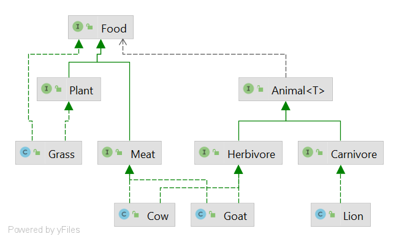

# Тестовое задание

### Условия:
- животное не может есть само себя и других животных своего вида
- любое животное может быть едой (как хищник, так и плотоядное)

### Состояние до:

### Моменты, которые можно улучшить:
- некоторые животные могут являться и поедающими кого-то (что-то) другое, и едой для других животных, а на диаграмме животное или ест, или является едой
- животные могут быть травоядными, всеядными или плотоядными, в данной ситуации это важно, но маркеров для различения типа животного нет

### Решение:
- выделить главные абстрактные характеристики в интерфейсы (на данный момент это или Animal или Food)
  
  по необходимости объявить поведение, которое будет свойственно объектам классов имплементирующим интерфейс
- сделать разделение этих абстрактных характеристик, на менее абстрактные: 

  еда может быть или растительной (Plant) или животного происхождения (Meat)
  
  животные могут быть либо травоядными (Herbivore), либо плотоядными (Carnivore) (по необходимости есть возможность добавить всеядных)
- В каждом классе сущности имплементить интерфейсы, которые к ней относятся. Например:
  `class Cow implements Herbivore, Meat`
  
- При реализации поведения, проверить что животное не ест себе подобных. Generics проверят, что животное есть только ту еду, что ему подходит

### Состояние после:

Если у Вас есть иное решение, или способ улучшить мое решение, я буду очень рада обсудить и внести правки

### Tests:
- Total coverage: 75% of lines
- Total business logic coverage: 85% of lines

Notes: business logic coverage is counted as coverage for the `model` package